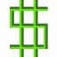

# Enrichissez-vous dans PRODUCTS. !

This README is in French, because the game itself isn't translated yet. But as soon as the product will be available in other languages, this file will be translated too.

## Qu'est-ce que PRODUCTS. ?

PRODUCTS. est le nouveau jeu de gestion ! Gère ta propre usine, fabrique tes produits, construit des lignes d'assemblages, et bien plus encore ... !

Plus d'informations sur le [site internet](martinheywang.github.io/PRODUCTS).

## Vous avez dit "Télécharger" ?

Vous pouvez télécharger ce jeu en version bêta actuellement soit sur le site internet, soit dans la partie 'releases' de ce dépôt.

- [Site internet](martinheywang.github.io/PRODUCTS)
- [Releases](https://github.com/MartinHeywang/PRODUCTS/releases)

## Qui-suis-je ?

Le mystérieux créateur de ce jeu devrait se présenter, quand même. C'est ce que je vais faire dans cette partie.

Je m'appelle Martin HEYWANG, je suis encore dans un lycée en France. J'apprends la programmation tout seul depuis 2 ans, j'ai développé des compétences principalement en Java, mais j'ai essayé le trio HTML/CSS/JS, pratiqué une sorte de C++ sur des cartes Arduino, testé React sur des sites internet.

### Ne partez pas comme ça !
Laisser une étoile (un like) et regardez ce projet évoluer en cliquant sur le bouton en haut à droite ! Cela m'aide beacoup à me motiver et à continuer. Cela est essentiel pour la survie de ce projet.

### Références

Ceci sont des libraires que j'ai utilisé pour créer le jeu. Il n'y a aucune obligation de citer, mais je préfère en parler tout de même.

- ORMLite : pour la base de donnée [(ormlite-core)](https://github.com/j256/ormlite-jdbc)
- Pixilart : pour les images [(Pixilart)](https://pixilart.com/draw)
- Figma : pour d'autres images et icônes [(figma)](https://figma.com)

- Maven : pour les *builds*
- Git : évidemment (*source version control*)